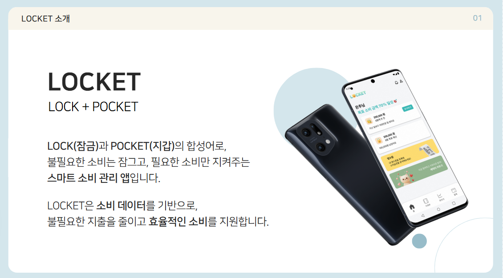
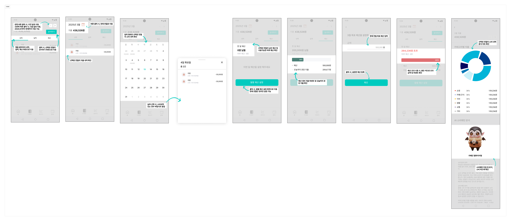
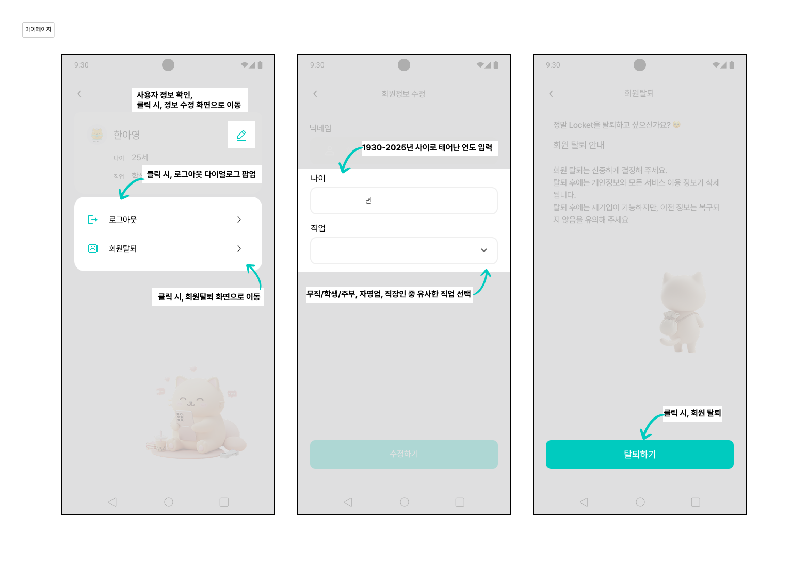
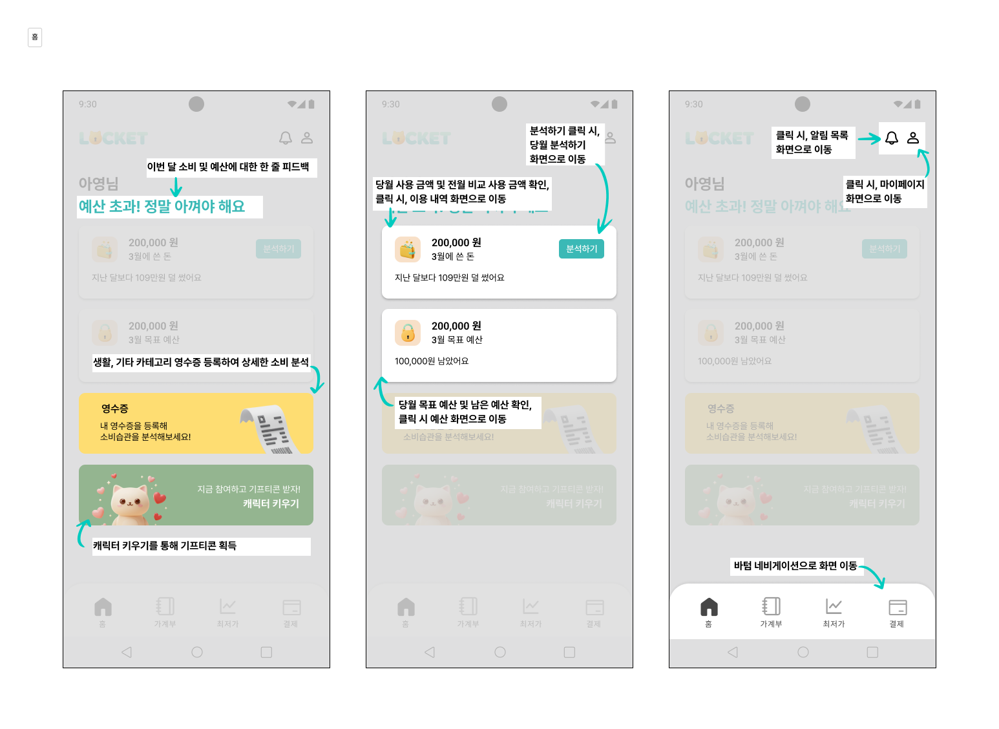
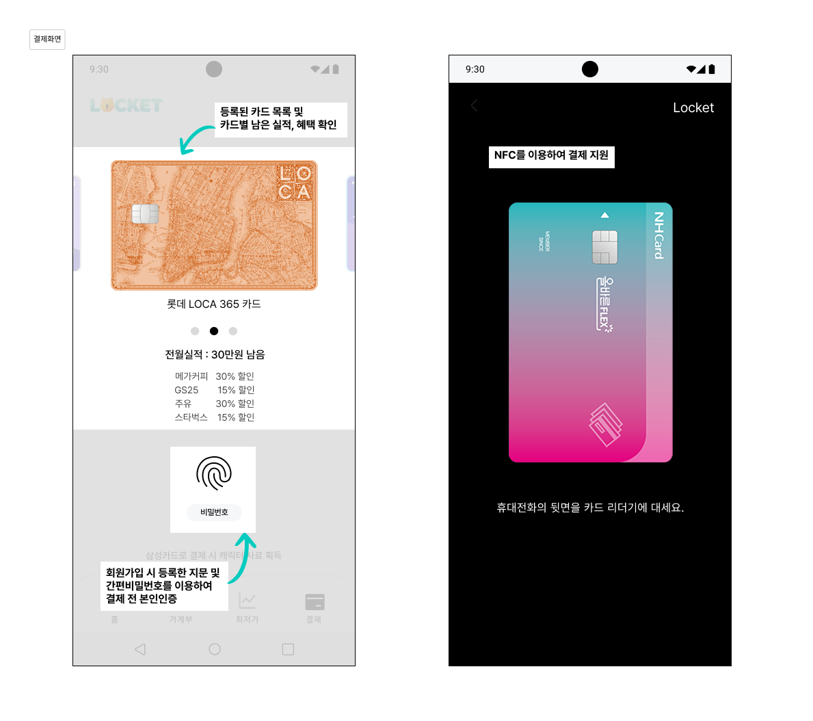
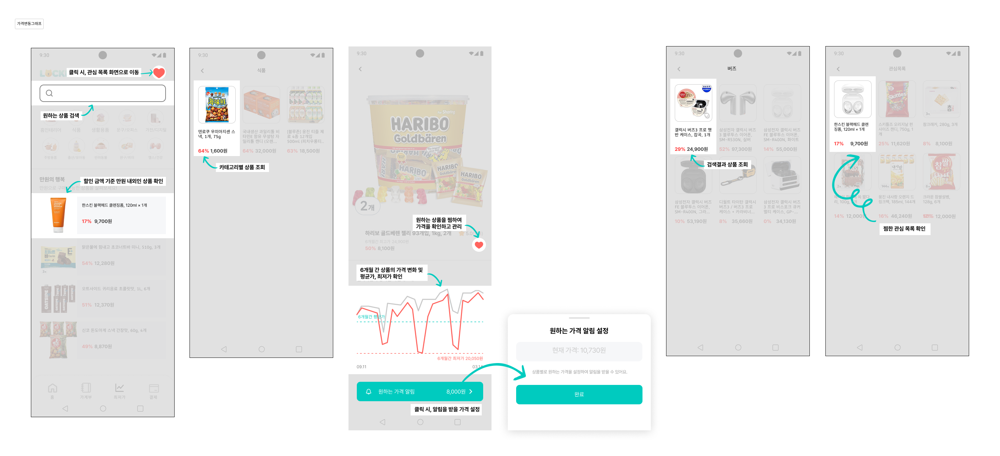
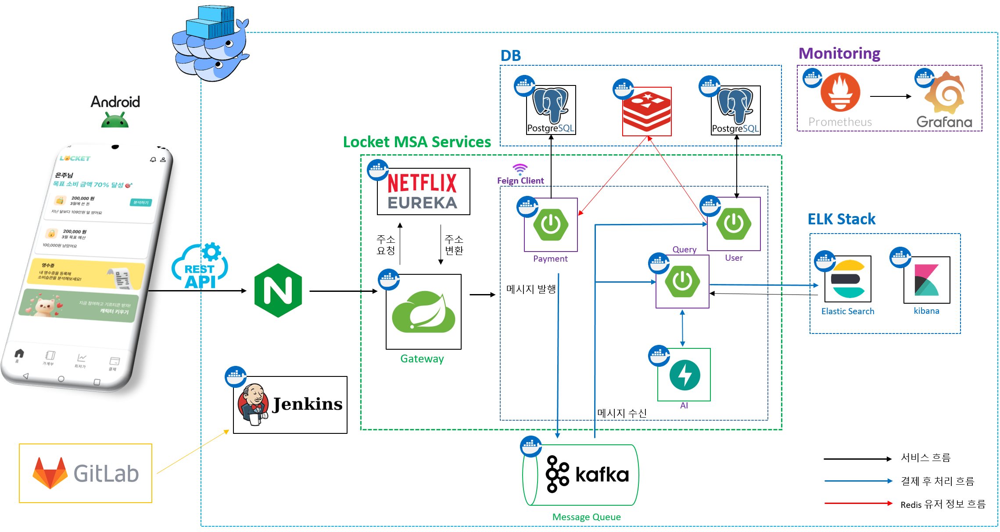
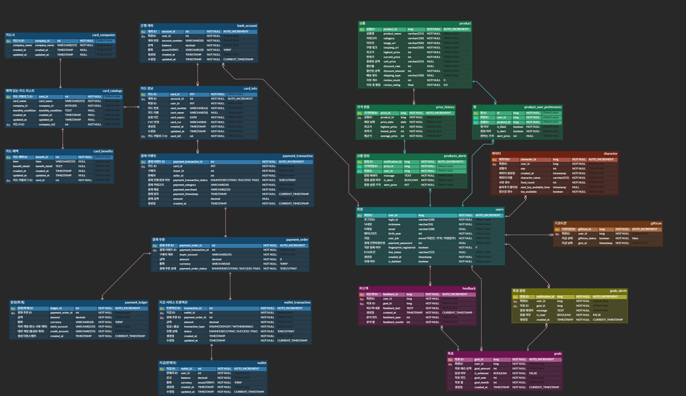

  <h1>Locket - Lock + Pocket</h1>
  
📚 결제 마이데이터 및 상품 최저가 정보를 결합한 스마트 소비 관리 앱  📚

 

    <!-- 우리 앱 설명 이미지 넣기 (마땅한 이미지 생기면 수정해야함ㅎㅎ) -->
    

 

  <a href="https://www.notion.so/API-1a4988e958dc81849b5dd85bb9bf960e">API 문서</a>
  &nbsp; | &nbsp;
  <a href="https://www.notion.so/1a4988e958dc8155a8a3cdacf3b1062b">요구사항 명세서</a>
  &nbsp; | &nbsp;
  <a href="https://www.notion.so/2-PJT-1a4988e958dc80ec934ae12bcae54c1f">Notion</a>

 

## ✍️ 프로젝트 개요

- **프로젝트명:** Locket
- **프로젝트 기간:** 2025.03.03 ~ 2025.04.11
- **SSAFY 12기 특화 프로젝트**

---

## ✍️ 프로젝트 소개

### 프로젝트 배경

최근 소비자들은 자신의 지출 습관을 파악하고 체계적으로 관리하려는 니즈가 증가하고 있습니다. 하지만 대부분의 가계부 앱은 단순한 기록 기능에 그치며, 실제로 내 소비 습관이 어떤지, 어디서 아끼고 개선할 수 있는지에 대한 분석은 제공되지 않습니다.

특히 MZ세대를 중심으로, 재테크와 소비를 동시에 관리하려는 흐름이 강해지면서, 실시간으로 소비 분석과 피드백을 받을 수 있는 지능형 가계부+핀테크 서비스에 대한 수요가 커지고 있습니다.

이러한 흐름에 맞춰, 우리는 소비 내역을 분석하고 유사 사용자와 비교하여 맞춤형 피드백을 제공하는 금융 분석 서비스를 개발하였습니다.

---

## 🚀 프로젝트 목표

1. **소비 패턴 분석 및 피드백 제공:** 
   - 사용자의 소비 데이터를 Elasticsearch 기반으로 저장 및 분석하여, 카테고리별 소비 비중, 요일별 지출 패턴, 월간 변화율 등을 시각화하고 피드백합니다.
    - 유사 연령대/직업군 사용자들과의 비교 분석을 통해, 과소비 항목을 진단하고 절약 방안을 제시합니다.

2. **가계부-핀테크 통합:** 
   - 단순 지출 기록을 넘어, 결제 API와의 연동을 통해 실시간으로 소비를 추적합니다.
    - 실제 카드 사용 내역을 기반으로 캐릭터 성장, 보상 시스템 등 게임 요소를 도입하여 사용자의 지속적인 동기부여를 유도합니다.

3. **실시간 알림 및 목표 관리:** 
   - 예산 초과 시 알림 제공, 목표 기반 소비 관리, 지출 상한 설정 등 다양한 기능을 통해 건강한 소비 습관 형성을 돕습니다.

## 📊 기대 효과

### 플랫폼
- **데이터 기반 개인 맞춤형 피드백 제공**: 사용자의 월별 소비 패턴과 비교 분석을 통해 의미 있는 인사이트 제공
- **유연한 서비스 확장성**: MSA 기반 구조와 Kafka, Redis, Elasticsearch의 도입으로 유연한 마이크로서비스 확장 및 고성능 유지

### 사용자
- **시각적 소비 인사이트 제공**: 도넛 차트, 트렌드 그래프 등을 통해 소비 내역을 직관적으로 확인
- **재미와 동기부여를 위한 게임화**: 캐릭터 성장 시스템 및 카드 사용 리워드로 지출 관리에 재미 요소 부여
- **건강한 소비 습관 형성 지원**: 목표 설정 기능과 실시간 피드백을 통해 소비 습관 개선 유도

---

 ## 📌 주요 기능

### 1️⃣ <b>로그인 페이지</b>
> 로그인 페이지

|                     **로그인 페이지**                      |
| :-----------------------------------------------------: | 
|  |

 

### 2️⃣ <b>가계부 페이지</b>

> 가계부 페이지

|                     **가계부 페이지**                      |
| :-----------------------------------------------------: | 
|  |

 

### 3️⃣ <b>마이 페이지</b>

> 마이 페이지

|                     **마이 페이지**                      |
| :-----------------------------------------------------: | 
|  |

 

### 4️⃣ <b>메인 페이지</b>

> 메인 페이지

|                      **메인 페이지**                      |
| :--------------------------------------------------------: | 
|  |

 

### 5️⃣ <b>영수증 페이지</b>

> 영수증 페이지

|                      **영수증 페이지**                      |
| :--------------------------------------------------------: | 
|  |
 

### 6️⃣ <b>결제 페이지</b>

> 결제 페이지

|                      **결제 페이지**                      |
| :--------------------------------------------------------: | 
|  |
 

### 7️⃣ <b>상품 페이지</b>

> 상품 페이지

|                      **상품 페이지**                      |
| :--------------------------------------------------------: | 
|  |
 

### 8️⃣ <b>알림 페이지</b>

> 알림 페이지

|                      **알림 페이지**                      |
| :--------------------------------------------------------: | 
|  |
 

<!--  -->
---

## 🧑‍💻 팀원 소개

<table>
  <tr>
    <td align="center" style="width:140px; height:140px;">
      <a href="">
        
           👑 손은주  
      </a>
    </td>
    <td align="center" style="width:140px; height:140px;">
      <a href="">
        
           ⛑ 강인혁  
      </a>
    </td>
    <td align="center" style="width:140px; height:140px;">
      <a href="">
        
           ⛑ 권정민  
      </a>
    </td>
    <td align="center" style="width:140px; height:140px;">
      <a href="">
        
           ⛑ 안세호  
      </a>
    </td>
    <td align="center" style="width:140px; height:140px;">
      <a href="">
        
           ⛑ 김기훈  
      </a>
    </td>
    <td align="center" style="width:140px; height:140px;">
      <a href="">
        
           ⛑ 한아영  
      </a>
    </td>
  </tr>
  <tr>
    <td align="center">UI/UX Backend</td>
    <td align="center">Backend</td>
    <td align="center">Infra Backend</td>
    <td align="center">Backend</td>
    <td align="center">UI/UX Android</td>
    <td align="center">UI/UX Android</td>
  </tr>
</table>

---

## ⚙️ 기술 스택

<table>
    <thead>
        <tr>
            <th>분류</th>
            <th>기술 스택</th>
        </tr>
    </thead>
    <tbody>
        <tr>
            <td>안드로이드</td>
            <td>
                
                
            </td>
        </tr>
        <tr>
            <td>백엔드</td>
            <td>
                
                
                
                 
                
                
                
                
            </td>
        </tr>
        <tr>
            <td>데이터베이스</td>
            <td>
                
                
                
            </td>
        </tr>
        <tr>
            <td>인프라</td>
            <td>
                
                
                
                
                
                 
                
                
                
                
                
                
            </td>
        </tr>
        <tr>
            <td>API</td>
            <td>
                
                
                
            </td>
        </tr>
        <tr>
            <td>디자인</td>
            <td>
                
            </td>
        </tr>
        <tr>
            <td>협업 도구</td>
            <td>
                
                
                
                
                
            </td>
        </tr>
    </tbody>
</table>

---

## 🔨 시스템 아키텍처

---

## 📊 ERD

<!-- ---

## 📂 문서 자료

- [포팅 메뉴얼]()
- [시연 시나리오]()
- [발표 자료]()
- [DATA]()

--- -->
